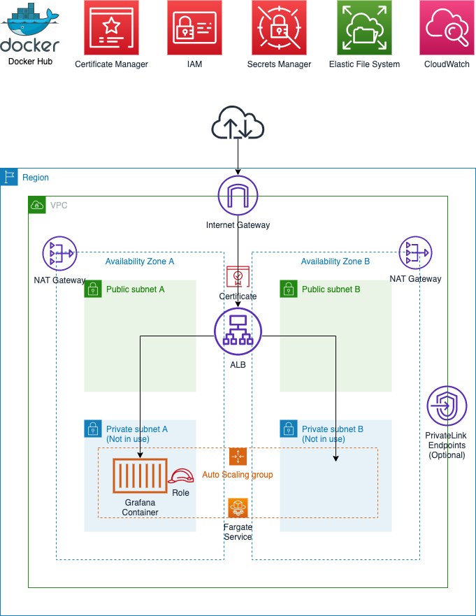

# CDK Grafana
## Summary
This project aims to deploy a resilient Grafana container on [AWS Fargate](https://aws.amazon.com/fargate/) using the [Grafana Docker Image](https://grafana.com/docs/grafana/latest/installation/docker/) on [DockerHub](https://hub.docker.com/r/grafana/grafana/) with no modifications/rebuilds of the container and minimal post deploy configuration of Grafana.

* The [AWS CDK](https://aws.amazon.com/cdk/) is used for infrastructure-as-code and deployment.  
* Persistance is provided by [Amazon EFS and AWS Fargate support](https://aws.amazon.com/about-aws/whats-new/2020/04/amazon-ecs-aws-fargate-support-amazon-efs-filesystems-generally-available/).  
* High Availability is supported but Autoscaling of the container is not provided at this point i.e. the ECS/Fargate service will ensure that only **one** Grafana container is online between Availability Zone A or B. 
* Access for the Grafana container to CloudWatch is configured with an IAM Role, preventing the need to configure Access/Secret keys
* The initial admin password is securely generated and configured using [Secrets Manager](https://console.aws.amazon.com/secretsmanager)
* A TLS certificate is automatically created deployed to the Application Load Balancer using [AWS Certificate Manager](https://aws.amazon.com/certificate-manager/) enabling secure HTTPS Only communication with the Grafana portal
* *Optional* PrivateLink endpoints can be added for increased security

## System Diagram


## Prerequisites
### Route 53
This project requires that you have already registered a domain and configured a hosted zone in [Route 53](https://aws.amazon.com/route53/). Once this is completed you will need the domainName, hostedZoneId and zoneName to continue the deployment.

### Git
* Install [git](https://git-scm.com/book/en/v2/Getting-Started-Installing-Git)
 
### Node.js
* Install [Node.js and NPM](https://nodejs.org/en/) 

### AWS
* An AWS account
* [AWS CLI](https://docs.aws.amazon.com/cli/latest/userguide/install-cliv2.html)
* AWS CLI [configured](https://docs.aws.amazon.com/cli/latest/userguide/cli-configure-quickstart.html#cli-configure-quickstart-config)
* [AWS CDK](https://docs.aws.amazon.com/cdk/latest/guide/getting_started.html)

## Download and Configure
### Clone Repo
```bash
git clone https://github.com/aws-samples/aws-cdk-grafana
```

### Install node modules
```bash 
cd aws-cdk-grafana
npm install
```

## Deploy
1. Deploy the project using the following command in the root of the aws-cdk-grafana folder (replacing the domainName, hostedZoneId and zoneName with the correct values for your environment)
``` bash
cdk deploy --context domainName="grafana.example.com" --context hostedZoneId="Z0123456789ABCDEFGHIJ" --context zoneName="example.com"
```
2. Wait for the new service to provision (This takes 5-10 mins)
3. Retrieve the admin password from [Secrets Manager](https://console.aws.amazon.com/secretsmanager)
4. Log into Grafana (url was output by the CDK Deploy), username = `admin` and use the password you retrieved from Secrets Manager
5. In Grafana add AWS CloudWatch as a Data Source: Configuration, Data Sources, CloudWatch, set the region to the region you wish to monitor e.g. us-east-1. Leave the other fields blank and click Save and Test.
6. On the Dashboards tab you can add one of the prebuilt Dashboards, e.g. AWS Lambda.

You can test Grafana config persists past a reboot by simply terminating the task in ECS, let a new task launch (a few seconds) and then logging back into Grafana and all of your configuration of the Dashboards will have persisted.  

`Note` changes to the Admin password in Secrets Manager will not be reflected in Grafana as this is set only once at initial deploy time.

## PrivateLink Endpoints (Optional)
PrivateLink endpoints can be added using the following command.  This will incur [additional cost](https://aws.amazon.com/privatelink/pricing/) for the endpoints, but will prevent CloudWatch, EFS (Elastic File System) and Secrets Manager traffic from traversing the public internet.
``` bash
cdk deploy --context domainName="grafana.example.com" --context hostedZoneId="Z0123456789ABCDEFGHIJ" --context zoneName="example.com" --context enablePrivateLink=="true"
```

## Security

See [CONTRIBUTING](CONTRIBUTING.md#security-issue-notifications) for more information.

## License

This library is licensed under the MIT-0 License. See the LICENSE file.


